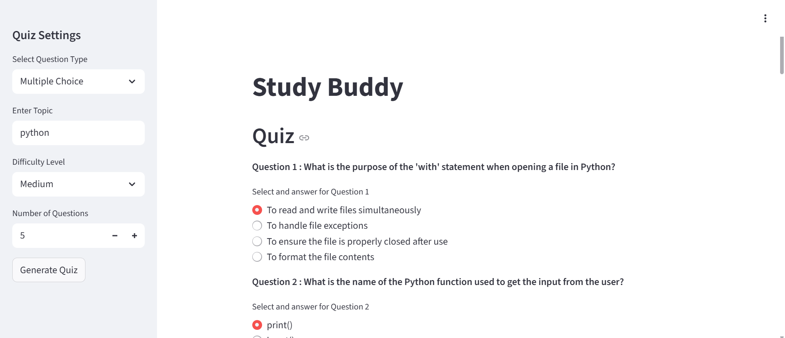
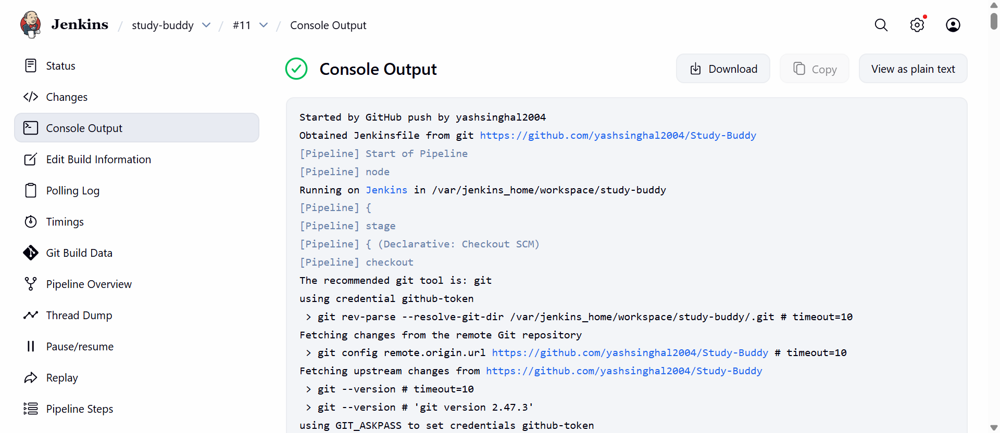
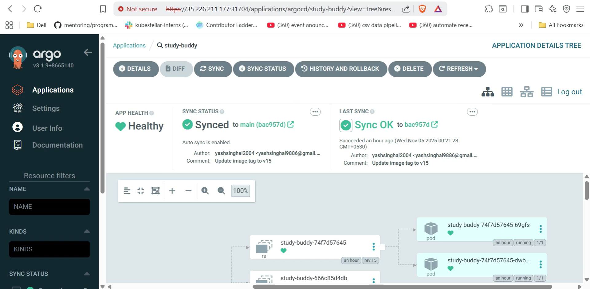

# Study Buddy AI

An AI-powered quiz generation and assessment platform built with Streamlit, LangChain, and Groq LLM (Llama 3.1), featuring comprehensive DevOps infrastructure with Kubernetes, Docker, Jenkins CI/CD, and ArgoCD for production-ready deployment and automated workflows.

## Table of Contents

- [Preview](#preview-study-buddy-ai--full-stack-deployment-and-automation)
- [Tech Stack](#tech-stack)
- [Context](#context)
- [Features](#features)
- [Quick Start](#quick-start)
  - [Prerequisites](#prerequisites)
  - [Setup](#setup)
  - [Docker Deployment](#docker-deployment)
  - [Kubernetes Deployment](#kubernetes-deployment)
- [CI/CD Pipeline](#cicd-pipeline)
- [Testing](#testing)
- [Contributing](#contributing)
- [License](#license)

## PREVIEW : Study Buddy AI Automation

### 1. Interactive Quiz Interface
Users can create customized quizzes by selecting topics, difficulty levels, question types, and the number of questions. The AI generates contextually relevant questions in real-time.



### 2. Jenkins CI/CD Pipeline
Automated build and deployment pipeline showing code checkout, Docker image building, versioning, and deployment orchestration through Jenkins.



### 3. ArgoCD GitOps Deployment
GitOps-based deployment visualization showing application health, sync status, and Kubernetes resource hierarchy managed through ArgoCD.



## Video Demo

https://www.youtube.com/watch?v=ukjcY50lZ7E

## Tech Stack

**Frontend & Backend:**
- **Frontend:** Streamlit (Python)
- **AI/ML:** LangChain + Groq LLM (Llama 3.1)
- **Data Processing:** Pandas
- **Backend:** Pydantic

**DevOps & Infrastructure:**
- **Containerization:** Docker
- **Orchestration:** Kubernetes (K8s)
- **CI/CD:** Jenkins Pipeline
- **GitOps:** ArgoCD
- **Deployment:** Docker Hub, Kubernetes clusters (Google Cloud Platform)
- **Configuration Management:** Environment variables, Kubernetes Secrets

## Context

- **Production-Ready Infrastructure:**  
  Fully containerized with Docker and orchestrated on Kubernetes (GCP), ensuring scalable and reliable deployment across environments with horizontal pod autoscaling.

- **Automated CI/CD Pipeline:**  
  Integrated Jenkins pipeline with automated Docker image building, versioning, and deployment to Kubernetes via ArgoCD for seamless continuous integration and delivery.

- **Efficient AI Question Generation:**  
  Leveraging Groq LLM (Llama 3.1) with LangChain for fast and contextually relevant question generation, supporting multiple question types and difficulty levels.

- **Structured Output Parsing:**  
  The backend uses Pydantic models with LangChain output parsers to ensure consistent, validated question structures with retry mechanisms for reliability.

## Features

1. **AI-Powered Question Generation:**  
   - Generates high-quality multiple-choice and fill-in-the-blank questions on any topic
   - Supports three difficulty levels: Easy, Medium, and Hard
   - Customizable number of questions (1-10 per quiz)

2. **Interactive Quiz Experience:**  
   - Real-time quiz generation and submission
   - Instant evaluation with detailed feedback
   - Score calculation with percentage display

3. **Results Management:**  
   - Export quiz results to CSV format
   - Timestamped result files for easy tracking
   - Download results directly from the interface

4. **Scalable Deployment:**  
   - Kubernetes orchestration with replica sets for high availability
   - Docker containerization for consistent environments
   - Automated deployment via ArgoCD

5. **CI/CD Automation:**  
   - Jenkins pipeline for automated builds and deployments
   - Automatic Docker image versioning and tagging
   - GitOps workflow with ArgoCD synchronization

## Quick Start

### Prerequisites

- Python 3.10+
- Docker & Docker Compose (for containerized deployment)
- Kubernetes cluster (for K8s deployment)
- Groq API key

### Setup

1. **Clone the repository**

```bash
git clone https://github.com/yashsinghal2004/Study-Buddy.git
cd Study-Buddy
```

2. **Create and activate virtual environment**

```bash
# Create virtual environment
python -m venv venv

# Activate virtual environment
# On Windows:
venv\Scripts\activate
# On macOS/Linux:
source venv/bin/activate
```

3. **Install dependencies**

```bash
pip install -r requirements.txt
```

Alternatively, install as a package:

```bash
pip install -e .
```

4. **Set up environment variables**

Create a `.env` file in the root directory:

```bash
GROQ_API_KEY=your-groq-api-key
```

5. **Run locally**

```bash
streamlit run application.py
```

Application available at: `http://localhost:8501`

### Docker Deployment

**Build the image:**

```bash
docker build -t study-buddy:latest .
```

**Run the container:**

```bash
docker run -p 8501:8501 -e GROQ_API_KEY=your-groq-api-key study-buddy:latest
```

Or using Docker Compose (if available):

```bash
docker-compose up
```

### Kubernetes Deployment

**1. Create namespace and secrets:**

```bash
kubectl create namespace study-buddy
kubectl create secret generic groq-api-secret \
  --from-literal=GROQ_API_KEY=your-groq-api-key \
  -n study-buddy
```

**2. Deploy application:**

```bash
kubectl apply -f manifests/deployment.yaml
kubectl apply -f manifests/service.yaml
```

**3. Access the application:**

```bash
# Get the NodePort service URL
kubectl get svc study-buddy-service -n study-buddy

# Or use port-forward for local access
kubectl port-forward svc/study-buddy-service 8501:80 -n study-buddy
```

## CI/CD Pipeline

The application includes a comprehensive Jenkins pipeline that automates:

1. **Code Checkout:** Pulls code from GitHub repository
2. **Docker Build:** Builds Docker image with versioned tags
3. **Image Push:** Pushes to Docker Hub registry
4. **YAML Update:** Updates Kubernetes deployment manifests with new image tags
5. **Git Commit:** Commits updated manifests back to repository
6. **Kubernetes Deployment:** Installs kubectl and ArgoCD CLI
7. **ArgoCD Sync:** Synchronizes application with ArgoCD for GitOps deployment

**Pipeline Configuration:**
- Docker Hub repository: `yash9886/study-buddy`
- Image tagging: `v${BUILD_NUMBER}`
- ArgoCD application: `study-buddy`

## Testing

```bash
# Test the application locally
streamlit run application.py

# Test Docker build
docker build -t study-buddy:test .

# Test Kubernetes deployment
kubectl apply -f manifests/ --dry-run=client
```

## Contributing

Contributions are welcome! Please follow these steps to contribute:

1. Fork the repository.
2. Create a new branch (`git checkout -b feature/YourFeature`).
3. Commit your changes (`git commit -m 'Add YourFeature'`).
4. Push the branch (`git push origin feature/YourFeature`).
5. Open a Pull Request detailing your changes.

For major changes, please open an issue first to discuss your proposed changes.

## 📄 License

MIT License © 2025 [Yash Singhal]
